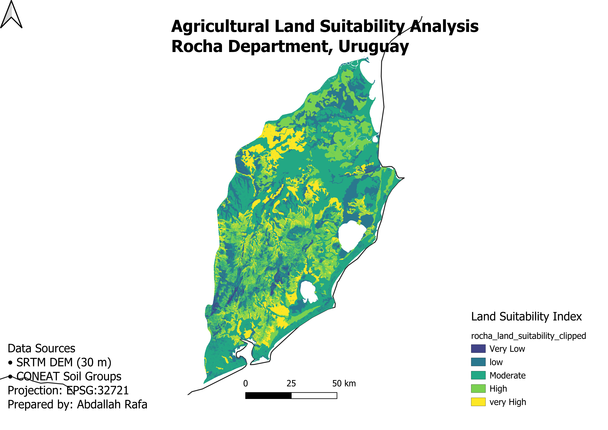

# Agricultural Land Suitability Analysis – Rocha Department, Uruguay

## Project Overview

This project evaluates agricultural land suitability in Rocha Department, Uruguay, using GIS-based Multi-Criteria Analysis (MCA).

The workflow combines elevation, slope, and soil characteristics to identify areas with different suitability levels for agriculture.

---

## Objective

Create a land suitability map that supports agricultural planning by integrating multiple environmental datasets.

---

## Study Area

- Rocha Department
- Uruguay

---

## Data Sources

- SRTM DEM (30 m)
- CONEAT Soil Groups
- Administrative Boundary of Uruguay

---

## GIS Workflow

1. Prepare DEM
2. Generate Slope
3. Reclassify Slope
4. Prepare Soil Groups
5. Assign Soil Suitability Scores
6. Rasterize Soil Scores
7. Weighted Overlay Analysis
8. Clip Final Raster
9. Produce Final Map Layout

---

## Final Output

### Land Suitability Map

Suitability classes:

- Very Low
- Low
- Moderate
- High
- Very High

---

## Software

- QGIS
- GDAL

---

## Skills Demonstrated

- Spatial Analysis
- Raster Processing
- Weighted Overlay
- Terrain Analysis
- Agricultural GIS
- Cartographic Design
- Data Preparation

---

## Author

**Abdallah Rafa**

GIS Analyst